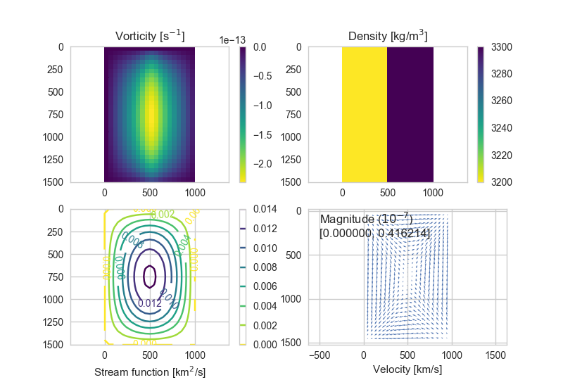

**CERI 8315 Term Porject** <br>
    - *Solving the velocity field of an incompressible fluid with constant
        viscosity using Navier-Stokes equation and stream function approaches*

**Main Features**
  * Automatic type conversion from VTK to ASCII for further processing
      (computing velocity from stream function)
    - Data reading from ASCII files is accelerated with Numpy (`np.loadtxt()`)
    - Improved efficiency, avoided manual conversion, easier to play around
        input parameters!
  * Solving coupled PDEs in FEniCS with intermediate results written into XML
      files
    - Wiping out of temporary files in the working directory is taken care of
        by the program
  * A progress bar taking down the completion percentage
    - See subroutine `navier_stokes.py` for the implementation

**Recommended Programs**
  * Paraview
  * Wingware IDE (better than Spyder)

**Dependencies**
  * prettytable (CSV file conversion)
    - Type `$ pip install prettytable` to install it.
  * FEniCS
    - Follow the tutorial `https://fenicsproject.org/download/`

**Tips**
  * The following aliases in `.bash_profile` is suggested:
    ```
    alias fenics-run="source activate fenicsproject"
    alias fenics-quit="source deactivate fenicsproject"
    ```

GENG, Yu <br>
`2017-11-29`


-------------------------------------------------------------------------------
 Run Navier-Stokes
-------------------------------------------------------------------------------

1. Go to `./Python/`

2. Use *ns_main* to solve the time evolution of pressure and velocity with the
    Navier-Stokes equation and different parameters.
   * Activate *FEniCS*
   * Type `$ python ns_main.py` in Terminal
   * Output:
     ```
     ./output/ns_solution/default/*.pvd
     ./output/ns_solution/vel_**/*.pvd  # solutions with different velocity B.C.s
     ./output/ns_solution/log/velocity.log
     ```

3. Use *ns_dst* to run double vortexes tests (nothing special but there's an
    additional B.C. at the bottom of the domain). Unless you are using a super
    computer, this will generally take for a while.
   * Type `$ python ns_dst.py` in Terminal
   * Output:
     ```
     ./output/ns_dst/*_v*/pressure.pvd  # folder is named by the material and
     ./output/ns_dst/*_v*/velocity.pvd  # parameters being used to do the test
     ```

4. Import the time series in ParaView and enjoy the animations.

* Programming notes
  - Do not adjust the number of steps when changing the total length of the
      time series i.e. denser steps should be used for shorter animations,
      sparser steps should be used for longer animations.
  - Since it is not as convenient to flip $y$-axis in Paraview as in Python, we
      changed the definition of positive direction. The sign of the gravity
      field was also reversed in the function.
  - If the output folders do not exist, `ns_main.py` will create them.
  - Each time you run `ns_main.py`, output from the previous session will be
      cleaned up.
  - Under each subfolder, solutions are saved as `pressure.pvd` and
      `velocity.pvd`


-------------------------------------------------------------------------------
 Run stream function - the finite element approach
-------------------------------------------------------------------------------

1. Go to `./Python/`

2. Use *fe_main* to solve the instantaneous velocity field with stream function
    and different parameters. Convert the solutions into ASCII format.
   * Activate *FEniCS*
   * Type `$ python fe_main.py` in Terminal
   * Output:
     ```
     ./output/fe_solution/pvd/*_omega.pvd  # output with different parameters
     ./output/fe_solution/pvd/*_psi.pvd    # are stored in the same folder
     ./output/fe_solution/csv/*_omega.txt
     ./output/fe_solution/csv/*_psi.txt
     ```

3. Use *fe_matplotlib* to do further processing (compute velocity from stream
    function and take down the behavior of solutions with different
    parameters).
   * De-activate *FEniCS*
   * Run `fe_matplotlib.py` in Wingware
   * Output:
     ```
     ./output/fe_solution/plots/*.png
     ./output/fe_solution/log/*.log
     ```

* Programming notes
  - Do not use `%e` or `%f` in a FEniCS `Expression()`. It will cause DOLFIN
      repeatedly compile the subroutine as you run your project.
  - The force function must be computed on a denser grid if it is an impulse or
      in any sharp shape. You will get all-zero solutions otherwise.
  - The two PDEs are solved subsequently inside the subroutine
      `solve_coupled()`. Intermediate results are saved as XML files which will
      be cleaned up by the program automatically.
  - Each time you run `fe_main.py`, the output in the `/pvd/` folder will be
      cleaned up. The converted CSV files from the previous output will also be
      cleaned up - this is especially important to notice for those who convert
      manually!


-------------------------------------------------------------------------------
 Run stream function - the finite difference approach
-------------------------------------------------------------------------------

1. Go to `./Python/`

2. Use *fd_main* to compute finite difference and compare different parameters,
    take down the behaviors of maximum velocities to the changes of parameters.
   * De-activate *FEniCS*
   * Run `fd_main.py` in Wingware
   * Output:
     ```
     ./output/fd_solution/plots/mesh_grid.png
     ./output/fd_solution/plots/force_function.png
     ./output/fd_solution/plots/*.png
     ./output/fd_solution/log/*.log
     ```

3. Read the scale of the velocities written from the screen output.

* Programming notes
  - All parameters produce a linear change in the velocity as they increase
      except for viscosity - a smaller stepsize is suggested to observe the
      behavior of `u_max vs. viscosity` better
  - Viscosities were divided by `1e21`, velocities were multiplied by `1e7` in
      the log files.


-------------------------------------------------------------------------------
 Plot all log files
-------------------------------------------------------------------------------

1. Go to `./Python/`

2. Use *plot_all_logs* to plot the behavior of maximum velocities because of
    the input parameter change.
   * De-activate *FEniCS*
   * Run `plot_all_logs.py` in Wingware
   * Output:
     ```
     ./output/ns_solution/log/pressure.png
     ./output/ns_solution/log/velocity.png
     ./output/fd_solution/log/fe_vs_fd.png
     ```

3. Adjust the paramters for all the previous computations and do more
    experiments.


**Example Output from Wing IDE**
```
[evaluate fd_main.py]
Output: fd_solution
Cleaning previous output...

Computing grid mesh and force function...
File saved as: ./output/fd_solution/plots/mesh_grid.png
File saved as: ./output/fd_solution/plots/force_function.png

Trying default parameters...
File saved as: ./output/fd_solution/plots/default.png

Trying different viscosities...
File saved as: ./output/fd_solution/plots/viscosity_01.png
<Performance Test>
File saved as: ./output/fd_solution/plots/viscosity_02.png
File saved as: ./output/fd_solution/plots/viscosity_03.png
File saved as: ./output/fd_solution/plots/viscosity_04.png
File saved as: ./output/fd_solution/plots/viscosity_05.png
File saved as: ./output/fd_solution/plots/viscosity_06.png
File saved as: ./output/fd_solution/plots/viscosity_07.png
File saved as: ./output/fd_solution/plots/viscosity_08.png
File saved as: ./output/fd_solution/plots/viscosity_09.png
File saved as: ./output/fd_solution/plots/viscosity_10.png
File saved as: ./output/fd_solution/plots/viscosity_11.png
File saved as: ./output/fd_solution/plots/viscosity_12.png
File saved as: ./output/fd_solution/plots/viscosity_13.png
File saved as: ./output/fd_solution/plots/viscosity_14.png
File saved as: ./output/fd_solution/plots/viscosity_15.png
File saved as: ./output/fd_solution/plots/viscosity_16.png
File saved as: ./output/fd_solution/plots/viscosity_17.png
File saved as: ./output/fd_solution/plots/viscosity_18.png
File saved as: ./output/fd_solution/plots/viscosity_19.png
File saved as: ./output/fd_solution/plots/viscosity_20.png
<Elapsed Time> 35.563898 sec
File saved as: ./output/fd_solution/log/viscosity.log

Trying different densities...
File saved as: ./output/fd_solution/plots/density_0100.png
File saved as: ./output/fd_solution/plots/density_0300.png
File saved as: ./output/fd_solution/plots/density_0500.png
File saved as: ./output/fd_solution/plots/density_0700.png
File saved as: ./output/fd_solution/plots/density_0900.png
File saved as: ./output/fd_solution/log/density.log

Trying different gravities...
File saved as: ./output/fd_solution/plots/gravity_01.png
File saved as: ./output/fd_solution/plots/gravity_03.png
File saved as: ./output/fd_solution/plots/gravity_05.png
File saved as: ./output/fd_solution/plots/gravity_07.png
File saved as: ./output/fd_solution/plots/gravity_09.png
File saved as: ./output/fd_solution/log/gravity.log

Done. Velocities are in the scale of 1e+07 in the log files.
```

The solution using default parameters:


